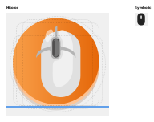

# RivalTune

<p align="center">
  
</p>

RivalTune is a GTK4/Libadwaita desktop app for configuring SteelSeries mice on Linux, powered by [`rivalcfg`](https://flozz.github.io/rivalcfg/).

Project page: https://github.com/polydezcom/RivalTune

## What it offers

- Automatic device detection for supported SteelSeries mice
- Sensitivity controls with multiple DPI presets
- Per-preset enable/disable toggles (for profiles that support more presets)
- Direct numeric DPI input alongside sliders
- Polling rate controls
- RGB zone controls and built-in light themes
- Save/apply named user presets
- Persistent per-device settings

## Supported devices

RivalTune includes profiles for a broad set of SteelSeries devices, including:

- Rival series: Rival 3, Rival 3 Gen 2, Rival 5, Rival 100/110/300/300S/310/600/700
- Aerox series: Aerox 3, Aerox 3 Wireless, Aerox 5
- Prime series: Prime, Prime Mini
- Sensei series: Sensei 310, Sensei TEN

Support depends on `rivalcfg` capabilities and connected hardware.

## Requirements

- Linux
- `rivalcfg` installed and working
- Appropriate udev rules for non-root device access

RivalTune can guide users through `rivalcfg` and udev setup from the onboarding screen.

## Build and run

### Meson (project default)

```bash
meson setup build
meson compile -C build
meson install -C build
```

### Flatpak

```bash
flatpak-builder --user --install --force-clean build-flatpak com.polydez.rivaltune.json
```

## Notes

- RivalTune is a frontend for `rivalcfg`; if `rivalcfg` cannot detect your device, RivalTune will not be able to configure it.
- Some features vary by model (for example, color zones and sensitivity preset count).

## License

GPL-3.0-or-later
